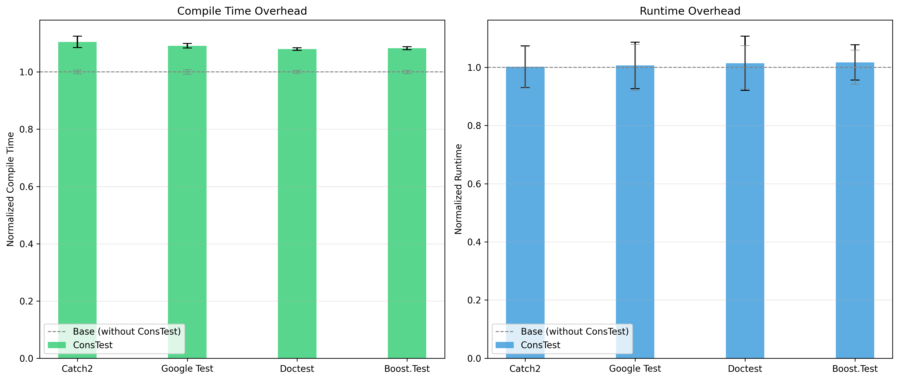

# 🧪 ConsTest

[](https://github.com/Teskann/constest/actions/workflows/test_clang.yml)
[](https://github.com/Teskann/constest/actions/workflows/test_gcc.yml)
[](https://github.com/Teskann/constest/actions/workflows/test_msvc.yml)
[](https://github.com/Teskann/constest/actions/workflows/test_framework_versions.yml)
[](https://github.com/Teskann/constest/actions/workflows/cpp_version.yml)
[](https://github.com/Teskann/constest/actions/workflows/cpm.yml)

**C++20 library that allows you to test your code at compile time. It's an extension of popular testing
frameworks.**

```C++
TEST_CASE("Example test case")
{
    CONSTEXPR_SECTION("My compile-time test")
    {
        std::vector vec = {1, 3};
        CONSTEXPR_REQUIRE(vec[0] == 1);
        CONSTEXPR_REQUIRE(vec[0] + vec[1] == 5); // ❌ compilation error
    };
}
```

**Works seamlessly with:**

<table>
  <tbody>
    <tr>
      <td>✅ <a href="https://github.com/google/googletest">Google Test</a></td>
      <td>👉 <a href="./tests/gtest/test_gtest.cpp">Example</a></td>
      <td>📃 <a href="doc/gtest.md">Using ConsTest with Google Test</a></td>
    </tr>
    <tr>
      <td>✅ <a href="https://github.com/catchorg/Catch2">Catch2</a></td>
      <td>👉 <a href="./tests/catch2/test_catch2.cpp">Example</a></td>
      <td>📃 <a href="doc/catch2.md">Using ConsTest with Catch2</a></td>
    </tr>
    <tr>
      <td>✅ <a href="https://github.com/onqtam/doctest">Doctest</a></td>
      <td>👉 <a href="./tests/doctest/test_doctest.cpp">Example</a></td>
      <td>📃 <a href="doc/doctest.md">Using ConsTest with Doctest</a></td>
    </tr>
    <tr>
      <td>✅ <a href="https://github.com/boostorg/test">Boost.Test</a></td>
      <td>👉 <a href="./tests/boost_test/test_boost.cpp">Example</a></td>
      <td>📃 <a href="doc/boost.md">Using ConsTest with Boost.Test</a></td>
    </tr>
  </tbody>
</table>

> ConsTest was initially [a contribution of mine to Catch2](https://github.com/catchorg/Catch2/pull/3027), but the PR
> was not merged. So I decided to make it better using C++20 features (Catch2 requires C++17) and to make it
> compatible with other popular testing frameworks.

## ✨ Why ConsTest?

Lately, C++ has been criticized for its lack of memory safety.

Testing at compile time is the **only way** to guarantee your code doesn't lead to memory
corruption issues. This is critical for writing safe libraries and software programs.

With ConsTest, you can:

- ✅ Test `constexpr` functions at compile time
- ✅ Guarantee absence of [undefined behavior](https://en.cppreference.com/w/cpp/language/ub.html)
  and [erroneous behavior](https://en.cppreference.com/w/cpp/language/ub.html#:~:text=erroneous%20behavior) in your
  tested code
- ✅ Ensure your code is free from memory leaks

---

## 🎯 Features

### Catch failures at compile-time

```c++
// Catch2 example
TEST_CASE("Example test case")
{
    CONSTEXPR_SECTION("Addition")
    {
        int a = 2;
        CONSTEXPR_REQUIRE(a * a == 4);
        CONSTEXPR_REQUIRE(a + a == 5); // ❌ compilation error
    };
}
```

### Test transient expressions at compile time

```c++
// Google Test example
TEST(example_tests, transient_constexpr_evaluation)
{
    CONSTEXPR_SECTION("std::sort and std::find")
    {
        std::vector vec = {5, 2, 8, 1, 9};
        std::ranges::sort(vec);

        CONSTEXPR_EXPECT_EQ(vec[0], 1);
        CONSTEXPR_EXPECT_EQ(vec[4], 9);

        auto it = std::ranges::find(vec, 8);
        CONSTEXPR_ASSERT_TRUE(it != vec.end());
    };
}
```

### Catch Undefined Behaviors at compile time

```c++
// Google Test example
TEST(example_tests, various_undefined_behavior) {
    CONSTEXPR_SECTION("Out of bounds") {
        std::vector vec = {1, 2, 3};
        CONSTEXPR_EXPECT_EQ(vec[3], 3); // ❌ compilation error
    };
        
    CONSTEXPR_SECTION("Double delete")
    {
        auto* const a = new int{ 10 };
        delete a;
        delete a; // ❌ compilation error
    };

    CONSTEXPR_SECTION("Use after free")
    {
        auto* const a = new int{ 10 };
        delete a;
        auto b = *a + 1; // ❌ compilation error
    };
}
```

> [!WARNING]
> Note that some compilers may have bugs that allow code with undefined behavior to compile successfully in constant
> evaluated contexts, even though it violates the C++ standard.

### Catch memory leaks at compile time

```c++
// Google Test example
TEST(example_tests, memory_leaks)
{
    CONSTEXPR_SECTION("new, no delete")
    {
        auto* const a = new int{ 10 }; // ❌ compilation error 
    };
}
```

### Seamless Integration with your favorite testing framework

Wrap your tests in `CONSTEXPR_SECTION` macros to ensure they are executed at compile time.
Prefix assertion macros from your testing framework with `CONSTEXPR_` to enable compile-time assertions.

Refer to the documentation of your testing framework for more information:

- 👉 [Google Test](doc/gtest.md)
- 👉 [Catch2](doc/catch2.md)
- 👉 [Doctest](doc/doctest.md)
- 👉 [Boost.Test](doc/boost.md)

### `CONSTEXPR_SECTION`s are also evaluated at runtime

So that it does not break your code coverage.

This is also important
because a call to a `constexpr` function [might give different results at runtime](https://godbolt.org/z/o6q3456eW).

---

## Overhead

As expected, ConsTest adds some overhead to your tests. The amount of overhead depends heavily on
the functions being tested, since the compiler needs to evaluate them at compile time.

However, the compile-time overhead may not be particularly high, depending on what is being tested. For example, when
compiling ConsTest's own tests, we observe the following results. Running tests at compile time increases compilation
time by approximately 10–15%. This is less than one could expect. On the other hand,
runtime overhead is negligible, even on very fast tested functions.



For more details about these benchmarks, check out the [benchmarking documentation](tests/benchmarks/README.md).

---

## 📋 Prerequisites

- A compiler supporting C++20, especially [
  `__cpp_lib_is_constant_evaluated`](https://en.cppreference.com/w/cpp/types/is_constant_evaluated.html)

What you can test in ConsTest depends on your compiler and the C++ standard version you use.

## 📦 Get ConsTest

### Using CPM (CMake Package Manager)

```cmake
CPMAddPackage("gh:teskann/constest@0.0.0")
target_link_libraries(your_target PRIVATE constest)

# Configure ConsTest for your testing framework
target_compile_definitions(your_target PRIVATE CONSTEST_CONFIG_XXX)
```

### Using Conan

conanfile.txt:

```conanfile.txt
[requires]
constest/0.0.0

[generators]
CMakeDeps
CMakeToolchain

[layout]
cmake_layout
```

CMakeLists.txt:

```CMakeLists.txt
target_link_libraries(my_target PRIVATE constest::constest)
```

## 🤝 Contributing

Contributions are welcome. Whether it's bug reports, feature requests, or pull requests.